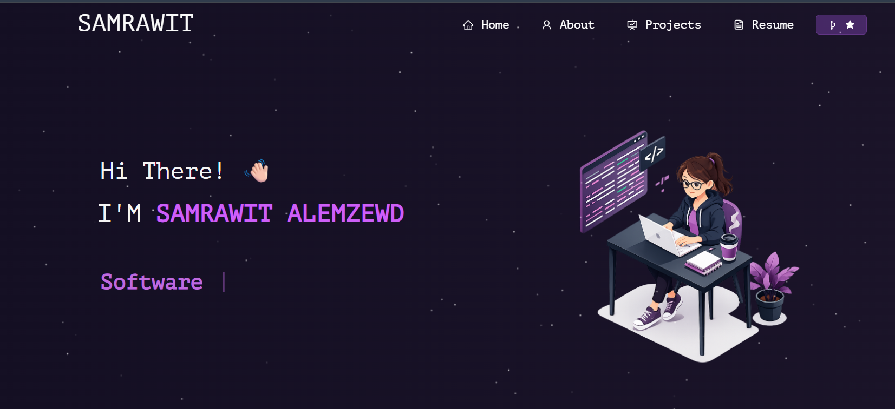

# Portfolio — What this project includes

This repository is a personal portfolio website built with React. It focuses on showcasing projects, skills and contact information across several pages and reusable components.



## Included Sections

- Home — landing section with a hero, brief intro and visuals.
- About — biography, skills (Techstack and Toolstack) and summary.
- Projects — project cards with descriptions, GitHub and demo links.
- Resume — downloadable / viewable resume components (`ResumeCustom.js`, `ResumeNew.js`).
- Contact — contact links and social profiles.

## Main Components (src/components)

- `Home/` — `Home.js`, `Home2.js`, `Type.js` (hero and intro components)
- `About/` — `About.js`, `AboutCard.js`, `Techstack.js`, `Toolstack.js`, `Github.js` (skills and tools)
- `Projects/` — `ProjectCards.js`, `Projects.js` (project listings and cards)
- `Resume/` — `ResumeCustom.js`, `ResumeNew.js` (resume display)
- Layout & helpers — `Navbar.js`, `Footer.js`, `Particle.js`, `Pre.js`, `ScrollToTop.js`

## Assets

- Images and icons: `src/Assets/`, `Images/`, and `public/` contain media used across the site.

## Run locally

Install dependencies and start the dev server:

```bash
npm install
npm start
```

Open http://localhost:3000 in your browser.

## Customize

- Edit content in `src/components/*` to change text, projects or sections.
- Update icons in `src/Assets/TechIcons` and wire them in `Techstack.js` / `Toolstack.js`.


